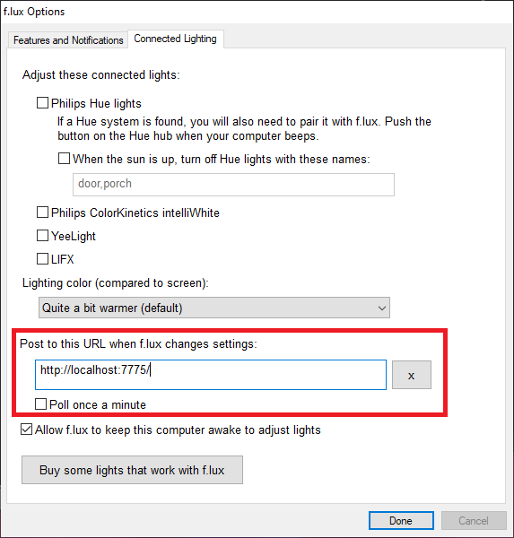

# FluxSmartLightingHook
Simple .NET Core hook for getting color temperature and brightness from f.lux

## Usage

1. Run the project in Visual Studio 2019 (or Visual Studio Code).

1. Go to f.lux options by right clicking f.lux tray icon and then clicking 'Options and Smart Lighting...'.

2. Go to the 'Connected Lighting' tab.

3. Change the address to the URL of your hook running in VS.

